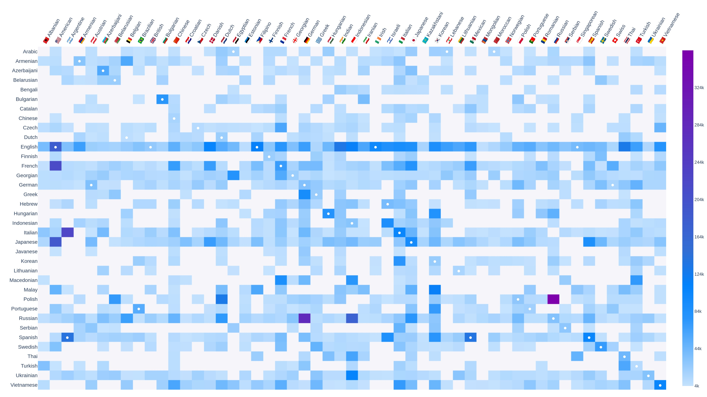

# Wikipedia cuisines correlation heatmap

This project aimed to obtain a [heatmap](https://en.wikipedia.org/wiki/Heat_map) between different languages Wikipedias and the length of [cuisines](https://en.wikipedia.org/wiki/Cuisine) pages

## Results

  

The obtained matrix/heatmap/table has on the rows different Wikipedia languages and on the rows multiple cuisines of the world. Every cell represents graphically and numerically the **length of the page** in that specific language

You can find **[here](https://albertosantagostino.github.io/blog/2020/10/06/cuisines_correlation_heatmap_en)** the post I wrote on this project, with all the interactive graphs!

### Other graphs and statistics

#### Full heatmap

  

#### Most famous cuisines (cumulative)

  

#### Most used languages (cumulative)

  

## Why?

* To have an idea of the interest for different cooking cultures around the world!  
  (I'm not saying that the length of a Wikipedia page reflects how much a country is interested in a specific foreign cuisine, but it's an indicator that can be taken into account, at least to do some really simple observation)

* To find some unexpected correlation, for example:  
  _"It seems that South-American country X seems to be really interested in cuisines from Asiatic country Y but not from cuisine from Z"_

* To have a framework to perform similar analysis in the future

* Because heatmaps are really nice to look at!